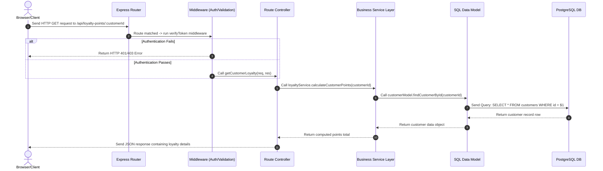

# Architecture Documentation

This document describes the high-level architecture, directory layout, technology choices, data flow, and development workflows for the **Pizza Joint** project.

---

## 1. Directory Structure

Below is the repository structure scaffolded for local development:

```text
/pizza-joint/
├── package.json                   # Root package configuration with script runners
├── package-lock.json
├── .gitignore                     # Core Git patterns to ignore node_modules, .env, build artifacts
├── /backend/                      # Express.js backend services
│   ├── server.js                  # Express entry point
│   ├── .env.example               # Template environment configuration variables
│   ├── /migrations/               # Plain SQL migration files (e.g. Vxxx__name.sql)
│   │   ├── V001__init_schema_migrations.sql
│   │   └── V001__init_schema_migrations.down.sql
│   ├── /src/                      # Backend source files
│   │   ├── /config/               # Database pool and environment setups
│   │   ├── /controllers/          # Route handler controllers
│   │   ├── /middleware/           # Auth, error, and validation middlewares
│   │   ├── /models/               # Direct DB query logic (No ORM)
│   │   ├── /routes/               # Route declarations (kebab-case paths)
│   │   ├── /services/             # Service logic layers (PascalCase classes)
│   │   └── /utils/                # Utilities and date helpers
│   └── /tests/                    # Integration and unit tests
├── /frontend/                     # React frontend client
│   ├── /public/                   # Static assets
│   │   └── index.html             # SEO optimized template HTML
│   └── /src/                      # Frontend source files
│   │   ├── /components/           # Reusable UI component elements
│   │   ├── /context/              # React Context Providers (e.g. AuthContext)
│   │   ├── /hooks/                # Custom React Hooks (e.g. useLoyaltyPoints)
│   │   ├── /pages/                # Route-mapped page-level views
│   │   ├── /services/             # API client and networking layers
│   │   └── /utils/                # Currency and UI helper utilities
├── /docs/                         # Project documentation
│   ├── ARCHITECTURE.md            # Architecture overview
│   ├── BRANCHING_GUIDE.md         # Git flow and rollback guide
│   ├── NAMING_CONVENTIONS.md      # Coding conventions and headers
│   ├── /api/                      # API endpoint definitions
│   ├── /db/                       # Database schema diagrams
│   └── /decisions/                # Architectural Decision Records (ADRs)
└── /scripts/                      # Development scripts
    └── migrate.js                 # Custom migration runner script
```

---

## 2. Technology Choices

| Tech Stack | Chosen Technology | Rationale |
| :--- | :--- | :--- |
| **Backend Framework** | **Node.js + Express** | High performance, lightweight, massive ecosystem, easy routing, and excellent database connectivity libraries. |
| **Frontend Framework** | **React** | Component-driven architecture, declarative UI, efficient state management, and highly reactive user experience. |
| **Database** | **PostgreSQL** | Extremely stable open-source relational database. Essential for storing relational structures (customers, loyalty points, ledger transactions) with strong ACID guarantees. |
| **Database Client** | **pg (node-postgres)** | Minimalist, robust PostgreSQL client interface. Allows writing raw, optimized SQL queries without the performance overhead or abstraction complexity of an ORM. |
| **Configuration** | **dotenv** | Follows the 12-factor app design pattern. Loads configurations from environment variables securely, separating secrets from code. |

---

## 3. Application Data Flow

The diagram below details the data flow pathway for requests between the client and the database:



---

## 4. Custom Database Migration System

A lightweight, plain-SQL migration system is built to track database versions without depending on heavy third-party packages.

### Design Principles:
1. **Alphabetical Execution:** Migrations are `.sql` files prefixed with `Vxxx__` (e.g. `V001__init.sql`). The prefix ensures that files are executed in alphabetical (which mirrors chronological) order.
2. **Metadata Tracking Table:** The runner maintains a `schema_migrations` table tracking version history:
   ```sql
   CREATE TABLE schema_migrations (
     id SERIAL PRIMARY KEY,
     version VARCHAR(10) NOT NULL UNIQUE,
     filename VARCHAR(255) NOT NULL,
     applied_at TIMESTAMPTZ DEFAULT NOW()
   );
   ```
3. **Transactions:** Each migration executes inside a single database transaction (`BEGIN` / `COMMIT`). If any error occurs, the entire transaction is rolled back (`ROLLBACK`).
4. **Companion Rollbacks:** Rollback scripts are placed in the same folder named with a `.down.sql` suffix (e.g. `V001__init.down.sql`).

### Migration Commands:
- **`npm run migrate:up`**: Executes all local migration files that have not yet been applied.
- **`npm run migrate:down`**: Executes the rollback script (`.down.sql`) for the single most recently applied migration, reverting the schema.
- **`npm run migrate:status`**: Prints a tabular view showing which migrations are applied and which remain pending.

---

## 5. Development & Branching Strategy

Refer to the documents below to align code styling, comment templates, and git development steps:

1. **Git Workflows & Rollbacks:** See [BRANCHING_GUIDE.md](file:///home/pulkit/projects/pizza_joint/docs/BRANCHING_GUIDE.md)
2. **Casing Conventions & JSDocs:** See [NAMING_CONVENTIONS.md](file:///home/pulkit/projects/pizza_joint/docs/NAMING_CONVENTIONS.md)
