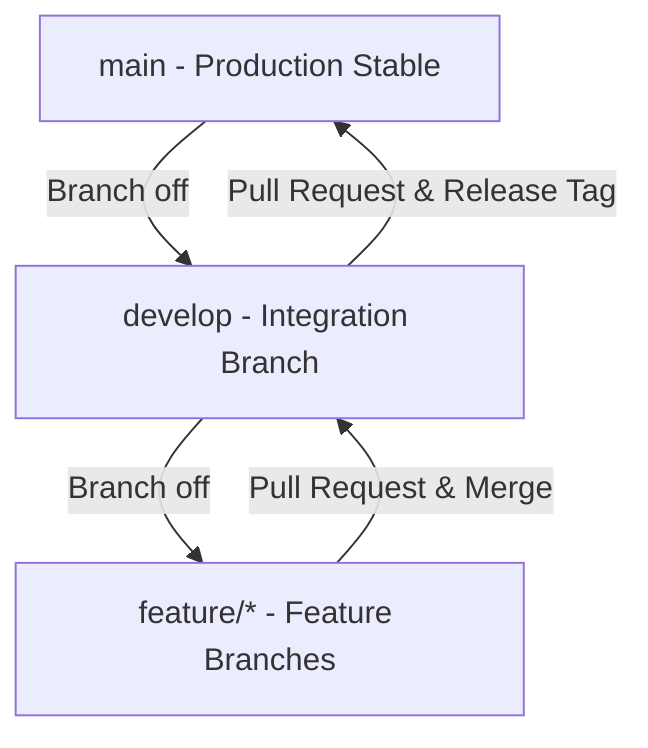

# Branching Guide

This document outlines the version control branching model, commit guidelines, merging procedures, and release processes for the **Pizza Joint** project.

---

## 1. Branching Strategy

The repository follows a modified Git Flow model, consisting of two permanent branches and short-lived feature branches:



### Permanent Branches
- **`main`**: Represents production-ready code. Commits on `main` are strictly controlled and tagged with release versions.
- **`develop`**: The primary integration branch where all feature branches merge. It represents the latest development state.

### Short-lived Branches
- **`feature/*`**: Used for individual feature implementation, bug fixes, or chores (e.g. `feature/loyalty-ledger`, `feature/scaffold`).

---

## 2. Feature Branch Workflow

All developers must follow these steps when working on a new feature or task.

### Step 1: Create a Feature Branch
Always start by checking out the latest state of `develop` and branching from there:
```bash
# Fetch latest updates
git checkout develop
git pull origin develop

# Create and switch to your feature branch
git checkout -b feature/your-feature-name
```

### Step 2: Develop and Commit
Commit your changes using logical chunks and clear commit messages.
```bash
# Add changes to staging
git add .

# Commit with a descriptive message
git commit -m "feat(loyalty): add loyalty ledger model and points calculations"
```

### Step 3: Keep Branch Up to Date
Periodically merge or rebase with `develop` to resolve conflicts early:
```bash
git checkout develop
git pull origin develop
git checkout feature/your-feature-name
git merge develop
```

---

## 3. Merging via Pull Request

To merge code back into `develop`, open a Pull Request (PR) on the central repository.

1. **Push Feature Branch:** Push your branch to the remote origin:
   ```bash
   git push origin feature/your-feature-name
   ```
2. **Open a PR:** Open a Pull Request from `feature/your-feature-name` into `develop`.
3. **Code Review:** The PR must be reviewed and approved by at least one other team member.
4. **Merge:** Once approved and all CI checks pass, merge the PR into `develop` (using squash-and-merge to keep history clean).

---

## 4. Release Tagging (Semantic Versioning)

When the code in `develop` is stable and ready for a release, a release PR is opened from `develop` into `main`. Once merged into `main`, tag the release following **Semantic Versioning** (`vMAJOR.MINOR.PATCH`):

```bash
# Ensure you are on the main branch with the latest changes
git checkout main
git pull origin main

# Tag the release (annotated tag)
git tag -a v1.0.0 -m "Release v1.0.0: Initial project scaffolding and architecture setup"

# Push the tag to the remote repository
git push origin v1.0.0
```

---

## 5. Rollback Procedures

If a critical issue is discovered in production, you can roll back the deployment or local state to a previously known stable release tag.

### Temporary Check out (Read-Only/Inspect)
To inspect the state of the codebase at a specific tag:
```bash
# Checkout to tag (enters a detached HEAD state)
git checkout v1.0.0
```
> [!WARNING]
> While in a detached HEAD state, any commits you make will not belong to any branch and will be lost unless you create a new branch.

### Permanent Rollback (Resetting Branch)
To permanently point a branch (e.g. `main` or a hotfix branch) back to a tag:
```bash
# Hard reset current branch to the specified tag
git reset --hard v1.0.0
```
> [!CAUTION]
> A hard reset will destroy any uncommitted changes and discard all commits made after the target tag on that branch. Use with caution.
