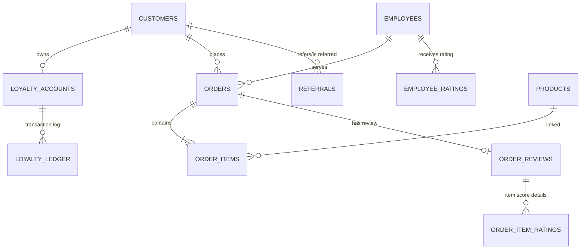

# Pizza Joint Master Documentation Package (v2.0)

This master documentation provides an exhaustive manual for the Pizza Joint project, detailing the system architecture, database schema, REST API endpoints, developer setup, and frontend component layout.

---

## 1. Repository Layout & Architecture

The repository is structured as a full-stack Javascript application containing separate directories for the backend services, the frontend interface, development scripts, and documentation files.

```text
/pizza-joint/
├── package.json                   # Root package configuration with script runners
├── package-lock.json
├── .gitignore                     # Core Git patterns to ignore node_modules, .env, build artifacts
├── /backend/                      # Express.js backend services
│   ├── server.js                  # Express entry point
│   ├── /migrations/               # Plain SQL migration files (e.g. Vxxx__name.sql)
│   ├── /src/                      # Backend source files
│   │   ├── /config/               # Database pool and environment setups
│   │   ├── /controllers/          # Route handler controllers
│   │   ├── /middleware/           # Auth, error, and validation middlewares
│   │   ├── /models/               # Direct DB query logic (No ORM)
│   │   ├── /routes/               # Route declarations
│   │   ├── /services/             # Service logic layers (PascalCase classes)
│   │   └── /utils/                # Utilities and date helpers
│   └── /tests/                    # Integration and unit tests
├── /frontend/                     # React frontend client
│   ├── /public/                   # Static assets
│   └── /src/                      # Frontend source files
│       ├── /components/           # Reusable UI component elements
│       ├── /context/              # React Context Providers
│       ├── /hooks/                # Custom React Hooks
│       ├── /pages/                # Route-mapped page-level views
│       ├── /services/             # API client and networking layers
│       └── /utils/                # Currency and UI helper utilities
├── /docs/                         # Project documentation
│   ├── ARCHITECTURE.md            # Architecture overview
│   ├── BRANCHING_GUIDE.md         # Git flow and rollback guide
│   ├── NAMING_CONVENTIONS.md      # Coding conventions and headers
│   ├── MASTER_DOC.md              # Consolidate Master Documentation Manual
│   ├── CHANGELOG.md               # Changelog record
│   ├── FINAL_REVIEW_REPORT.md     # Final QA assessment report
│   └── /db/                       # Database schema diagrams
└── /scripts/                      # Development scripts
    └── migrate.js                 # Custom migration runner script
```

---

## 2. Developer Setup Guide

### System Prerequisites
- **Node.js**: v18.0.0 or higher (v22.19.0 recommended)
- **PostgreSQL**: v13.0 or higher (requires `pgcrypto` extension for uuid generation)

### Installation Steps

1. **Clone the Repository**:
   ```bash
   git clone <repository_url>
   cd pizza_joint
   ```

2. **Install Root Dependencies**:
   ```bash
   npm install
   ```

3. **Configure Environment Variables**:
   Create a `.env` file in the root directory based on the following template:
   ```env
   PORT=3000
   NODE_ENV=development

   # Database Connection (PostgreSQL)
   DB_HOST=localhost
   DB_PORT=5432
   DB_NAME=pizza_joint_db
   DB_USER=postgres
   DB_PASSWORD=pizza

   # Authentication Config
   JWT_SECRET=super_secret_dev_pizza_token_key_12345
   JWT_EXPIRES_IN=7d

   # Loyalty Programme Config
   LOYALTY_POINTS_PER_RUPEE=0.1
   LOYALTY_REDEMPTION_RATE=10
   LOYALTY_EXPIRY_MONTHS=12
   ```

4. **Run Database Migrations**:
   ```bash
   npm run migrate:up
   ```

5. **Start the Backend Server**:
   ```bash
   node backend/server.js
   ```

---

## 3. Database Schema Overview (v2.0)

The relational schema maps out customer management, orders, menu items, order reviews, staff feedback, and the loyalty program ledgers.



### Key Table Definitions

1. **`customers`**: Stores registration profile, date of birth (for birthday multipliers), and referral references.
2. **`loyalty_accounts`**: Tracks the customer's current spendable points, lifetime earnings, current tier (`dough`, `crust`, `legend`), and tier anniversary dates.
3. **`loyalty_ledger`**: Immutable point transaction ledger tracking point allocations (earns, redemptions, expirations, admin grants) with associated order or employee audit fields.
4. **`order_reviews`**: Stores customer feedback on orders, rating overall score, food quality, and service speed.
5. **`employee_ratings`**: Tracks scores (1-5), comments, and tags (`friendly`, `fast`) given to serving employees. Admins can exclude ratings from calculation.
6. **`referrals`**: Records when one customer invites another, awarding 200 points to the referrer when the referred user completes their first order.

---

## 4. API Reference

All requests must be prefixed with `/api/v1`.

### 1. Authentication Module

| Endpoint | Method | Security Context | Description |
| :--- | :--- | :--- | :--- |
| `/auth/register` | `POST` | Public | Register customer account. |
| `/auth/login` | `POST` | Public | Authenticate user (returns JWT token in `data.token`). |
| `/auth/logout` | `POST` | Authenticated | Logs user out, blacklisting token in memory. |
| `/auth/me` | `GET` | Authenticated | Retrieves current logged in user details. |

### 2. Reviews & Ratings Module

| Endpoint | Method | Security Context | Description |
| :--- | :--- | :--- | :--- |
| `/reviews/order` | `POST` | Authenticated (Customer) | Submit overall review for a delivered order. |
| `/reviews/employee` | `POST` | Authenticated (Customer) | Rate service employee assigned to a completed order. |

### 3. Loyalty Programme Module

| Endpoint | Method | Security Context | Description |
| :--- | :--- | :--- | :--- |
| `/loyalty/account` | `GET` | Authenticated (Customer) | Fetches logged in customer's loyalty balance and tier. |
| `/loyalty/ledger` | `GET` | Authenticated (Customer) | Retrieves paginated points transaction history. |
| `/loyalty/redeem` | `POST` | Authenticated (Customer) | Applies points for checkout discount (min 100, max 50% order value). |
| `/loyalty/admin/overview` | `GET` | Authenticated (Admin) | Queries global loyalty statistics. |
| `/loyalty/admin/grant` | `POST` | Authenticated (Admin) | Manually adjust a customer's points balance. |
| `/loyalty/admin/customer/:id` | `GET` | Authenticated (Admin) | Audits a specific customer's full ledger history. |

### 4. Employee of the Week (EOTW) Module

| Endpoint | Method | Security Context | Description |
| :--- | :--- | :--- | :--- |
| `/employees/eotw/current` | `GET` | Public | Retrieves current Employee of the Week profile and details. |
| `/admin/run-tier-check` | `POST` | Authenticated (Admin) | Manually runs annual tier sweeps and point expirations. |
| `/admin/run-eotw-calculation`| `POST` | Authenticated (Admin) | Manually run prior-week EOTW weighted scores selection. |

---

## 5. Frontend Architecture & Component Tree

The frontend is built using React, React Router, Tailwind CSS, and vanilla JS contexts.

### Main Views (`/frontend/src/pages/`)
- **Customer Pages**:
  - `HomePage.jsx`: Landing portal showcasing promotions and weekly Employee of the Week.
  - `MenuPage.jsx`: Main menu showcasing product cards with interactive cart add buttons.
  - `AccountPage.jsx`: Customer profile detail editor.
  - `RewardsPage.jsx`: Displays loyalty balance, active tier, and ledger points history.
  - `OrderPage.jsx`: Checkout portal displaying order item summary, delivery details, and discount inputs.
  - `OrderHistoryPage.jsx`: Lists customer purchase records.
  - `OrderTrackPage.jsx`: Live order tracker map visualizer.
  - `ReviewPage.jsx`: Multi-score order review and employee rating questionnaire page.
- **Administrative Pages (`pages/admin/`)**:
  - `AdminDashboard.jsx`: Navigational container wrapper.
  - `AdminHome.jsx`: Operations dashboard summary metrics.
  - `AdminSales.jsx`: Sales reports and graphs.
  - `AdminProducts.jsx`: Add, edit, and delete tools for menu offerings.
  - `AdminEmployees.jsx`: Shifts, punctuality, and staff profile viewer.
  - `AdminOperations.jsx`: Manual calculations triggers panel.
  - `AdminLoyalty.jsx`: Manage customer loyalty ledger adjust tools.

### Core Component Structure (`/frontend/src/components/`)
- `Navbar.jsx`: Brand navigation header containing responsive link lists, account status, and interactive cart count indicators.
- `Footer.jsx`: Bottom branding links.
- `ProductCard.jsx`: Menu listing details card component.
- `ProtectedRoute.jsx`: Authentication token route guard wrapper.
- `AdminRoute.jsx`: Admin role routing check wrapper.

### Data Flow contexts & Services
- **State contexts**:
  - `AuthContext.jsx`: Provides authentication states (`user`, `token`), manages logins, logouts, and token refreshes.
  - `CartContext.jsx`: Manages shopping cart states (quantities, subtotal, checkouts).
- **Service API clients**:
  - `apiService.js`: Axios/fetch client wrapper containing global header interceptors.
  - `authService.js`, `orderService.js`, `productService.js`, `loyaltyService.js`, `employeeService.js`, `reviewService.js`, `adminService.js`: Dedicated networking adapters hitting the corresponding REST API modules.
